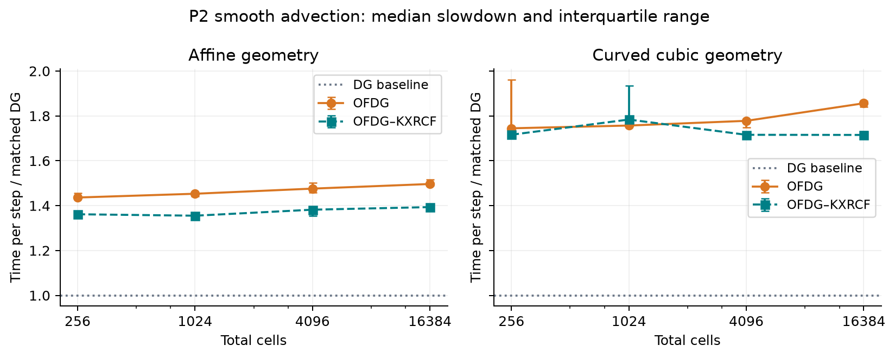
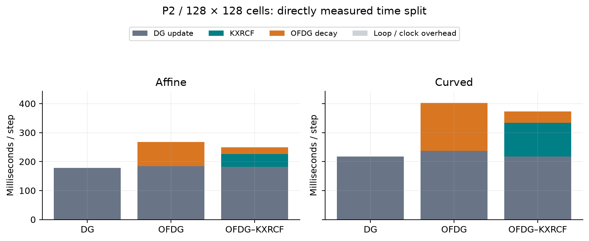
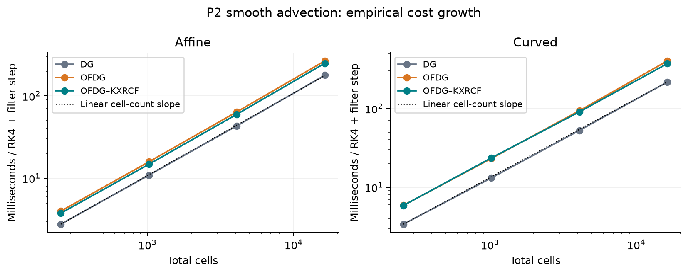

# OFDG performance benchmark

Single-rank, release-build measurements on the current laptop. This is scalar 2D transport, not Euler or MPI scaling.

Across the tested meshes, time per step grows approximately linearly with total cell count. For smooth P2 transport, OFDG adds about 44–50% over affine DG and 75–86% over curved DG. OFDG–KXRCF adds about 35–39% and 72–78%, respectively. These are stepping costs; curved operator construction is a separate, substantial initial cost.

KXRCF is not uniformly faster: at 64² cells with curved P1 geometry it costs about 2.05 times DG, compared with 1.80 times DG for ungated OFDG. The following measurements separate degree, geometry, data dependence, and setup.

## Method

- Same production MFEM DG, RK4, OFDG decay, and KXRCF operators as the numerical drivers; production solver code is unchanged.
- One warm-up round excluded from summaries, plus five measured repetitions. Method order rotates between repetitions. Each sample repeats a reset trajectory until at least 0.25 seconds of timed evolution has accumulated.
- Matched physical interval T=0.005, CFL=0.15, velocity (0.7,0.3), post-step filtering. At fixed mesh and degree, every method uses the same timestep and number of steps. Short trajectories measure cost, not final solution accuracy.
- Smooth initial data: sin²(pi(x+y)). Discontinuous initial data: 1 for x<0.5, otherwise 1.4, periodically extended. Curved geometry is the cubic interpolation of the existing 0.04*sin(2*pi*x)*sin(2*pi*y) displacement in both coordinates.
- Constant prescribed velocity permits a fixed CFL timestep; the driver’s per-step CFL reduction is omitted equally for all methods. This is single-rank RK4-plus-filter cost rather than complete executable wall time.
- Per-step clocks surround DG updates, indicator plus activity counting, and decay plus output copy. Setup, state reset, error checks, file I/O, process startup, and destruction are excluded from time-stepping measurements.
- Slowdown is the median of five paired time-per-step ratios against DG. Error bars are interquartile ranges, not confidence intervals. Direct filter share is (indicator + decay) / total for that filtered run; it is different from overhead relative to a separate DG run.
- Filter setup is the median repeated constructor time after warm-up; common mesh/DG setup is measured once per configuration. Setup is not included in stepping ratios. The process peak is sampled aggregate RSS.
- Single MPI rank, one numerical-library thread. Eight available processors were confirmed; this uses less than half. Limits: 4 GB, 300 seconds/check, no new launches after 45 minutes, 60 minutes total. The main ledger reserves 300 seconds for the preliminary longer-trajectory pilot.

## P2 mesh refinement, smooth data

| Geometry | Grid | DG ms/step | OFDG / DG | Gated / DG | OFDG share | Gated share | Active cells |
|---|---:|---:|---:|---:|---:|---:|---:|
| Affine | 16² | 2.762 | 1.436× | 1.362× | 31.0% | 27.1% | 0.00% |
| Affine | 32² | 10.881 | 1.453× | 1.355× | 31.2% | 27.1% | 0.00% |
| Affine | 64² | 43.321 | 1.476× | 1.382× | 31.5% | 27.1% | 0.00% |
| Affine | 128² | 178.493 | 1.497× | 1.394× | 31.0% | 27.0% | 0.00% |
| Curved | 16² | 3.396 | 1.745× | 1.716× | 41.8% | 41.7% | 0.52% |
| Curved | 32² | 13.139 | 1.757× | 1.784× | 42.8% | 42.9% | 0.39% |
| Curved | 64² | 52.726 | 1.778× | 1.716× | 41.8% | 41.2% | 0.32% |
| Curved | 128² | 216.848 | 1.856× | 1.715× | 41.0% | 41.7% | 0.33% |

## Curved versus affine absolute stepping cost (P2)

Each entry divides the curved median time per step by the affine median for the same method and grid. These ratios include the geometry cost in both the DG operator and filtering.

| Grid | DG curved / affine | OFDG curved / affine | Gated curved / affine |
|---|---:|---:|---:|
| 16² | 1.229× | 1.477× | 1.560× |
| 32² | 1.207× | 1.468× | 1.598× |
| 64² | 1.217× | 1.464× | 1.514× |
| 128² | 1.215× | 1.510× | 1.491× |

## Empirical growth

Fit: time per step proportional to (total cells)^alpha. Alpha=1 is linear growth. These finite-range fits are not proofs of asymptotic complexity. At fixed final time and a CFL timestep, the number of steps also grows with cells per direction.

| Degree | Geometry | DG alpha | OFDG alpha | Gated alpha |
|---|---|---:|---:|---:|
| 1 | Affine | 1.003 | 1.000 | 0.997 |
| 1 | Curved | 1.004 | 0.985 | 1.003 |
| 2 | Affine | 1.002 | 1.011 | 1.009 |
| 2 | Curved | 1.000 | 1.015 | 0.995 |
| 3 | Affine | 1.001 | 1.012 | 1.003 |
| 3 | Curved | 1.009 | 1.008 | 1.001 |

## Degree dependence at 64² cells

| Degree | Geometry | DG ms/step | OFDG / DG | Gated / DG |
|---|---|---:|---:|---:|
| 1 | Affine | 33.288 | 1.477× | 1.449× |
| 1 | Curved | 41.041 | 1.802× | 2.046× |
| 2 | Affine | 43.321 | 1.476× | 1.382× |
| 2 | Curved | 52.726 | 1.778× | 1.716× |
| 3 | Affine | 54.775 | 1.559× | 1.366× |
| 3 | Curved | 68.263 | 1.791× | 1.685× |

## KXRCF data dependence (P2)

| Geometry | Grid | Data | Active cells | Gated / DG | Indicator ms | Decay ms |
|---|---:|---|---:|---:|---:|---:|
| Affine | 16² | Smooth | 0.00% | 1.362× | 0.674 | 0.349 |
| Affine | 16² | Jump | 20.83% | 1.469× | 0.664 | 0.584 |
| Affine | 64² | Smooth | 0.00% | 1.382× | 10.702 | 5.495 |
| Affine | 64² | Jump | 7.64% | 1.412× | 10.635 | 6.865 |
| Curved | 16² | Smooth | 0.52% | 1.716× | 1.844 | 0.597 |
| Curved | 16² | Jump | 15.10% | 1.856× | 1.811 | 0.971 |
| Curved | 64² | Smooth | 0.32% | 1.716× | 27.866 | 9.502 |
| Curved | 64² | Jump | 7.00% | 1.811× | 28.924 | 12.810 |

## Incremental setup (P2)

| Geometry | Grid | Common setup, one observation | OFDG construction | OFDG + KXRCF construction |
|---|---:|---:|---:|---:|
| Affine | 16² | 2.8 ms | 1.7 ms | 3.4 ms |
| Affine | 32² | 8.4 ms | 6.6 ms | 13.2 ms |
| Affine | 64² | 32.7 ms | 25.9 ms | 53.2 ms |
| Affine | 128² | 128.6 ms | 105.8 ms | 214.2 ms |
| Curved | 16² | 5.5 ms | 68.2 ms | 74.0 ms |
| Curved | 32² | 23.1 ms | 268.3 ms | 292.8 ms |
| Curved | 64² | 77.8 ms | 1097.0 ms | 1197.7 ms |
| Curved | 128² | 305.1 ms | 4360.4 ms | 4762.5 ms |

## Reproduce

From the repository root: `make build/release/benchmarks/filter_performance`, then `python3 scripts/run_filter_performance.py --output measurements/performance/new-run --prior-budget-seconds 0`. Finally run `python3 scripts/analyze_filter_performance.py --input measurements/performance/new-run`. Use a new directory when sources, settings, or binaries change. The current run used a 300-second conservative pilot reservation.

## Interpretation and limits

KXRCF can skip inactive face contributions and shell updates, but the current OFDG kernel still computes global scaling and builds derivative states on every cell. Zero activated cells therefore does not mean zero filtering cost. Curved geometry additionally increases physical quadrature/evaluation work. These code observations explain plausible costs; the present phase timers do not resolve every internal sub-operation.

Overhead relative to DG and direct filtering share are different measurements. The DG phase inside a filtered run may itself take longer than in the separate baseline, so the slowdown need not equal one divided by the unfiltered time fraction. Cache effects or processor variation are possible contributors, but these measurements do not distinguish them. The largest time-per-step interquartile range is about 14% of its median; small differences should not be overinterpreted.

Comparisons are specific to scalar quadrilateral DG, these degrees, cubic deformation, and one rank. They do not establish Euler overhead, performance on triangles/3D, strong scaling, or large-system asymptotic behaviour. The ordinary DG update itself can have a different curved-mesh cost; compare both absolute times and matched DG ratios. Repeated short reset trajectories emphasize early-time detector activity.

Main benchmark ledger: 13.51 minutes including 5.0 minutes reserved for pilot work. Sampled peak RSS: 710.2 MiB. Completed configurations: 24/24. Failed/limited configurations: none.

Raw data and exact commands: `/Users/timozund/Documents/master_thesis/codex_dev/measurements/performance/2026-09-07-main`. Summary: `summary.csv`; fitted exponents and quartiles: `summary.json`. The pilot remains in the sibling `2026-09-07` directory. No thesis result asset was replaced.
